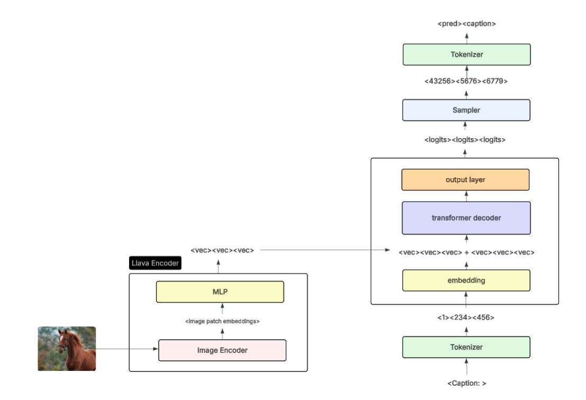

# Image Captioning with Language Models

A Vision Language Model inspired by techniques introduced in the Llava (Large Language and Vision Assistant) [paper](https://arxiv.org/pdf/2304.08485). This approach adds multimodality to a language model by training a small multilayer perceptron (MLP) to project image patch embeddings to the text embedding space and prepending to text embeddings before feeding to the decoder module. The following diagram depicts the VLM architecture. 



See the full paper for more details about motivations, experiment results, and future research. 

## Environment Setup

To setup the environment locally, run `pip install environment.txt`.

### Anaconda

If using Anaconda:

```
conda env create -f environment.yaml
conda activate image_captioning
```

### Google Collab

If you do not have access to a GPU, the best way to run this project is in Google Collab. You can download the [Google Drive for Desktop](https://support.google.com/drive/answer/10838124?hl=en) application and sync this folder to Google drive. Then, import an experiment notebook and modify the cell at the top of the notebook to include the path to your mounted directory. The notebooks install the dependencies not included in collab. 

## Overview

- `/encoders/image_encoder_with_projections.py`: file containing the llava mlp implementation with pretrained encoders (currently supports `clip` and `vit` encoders)
- `/encoders/image_encoder.py`: file containing the bare pretrained image encoders to output patch embeddings (currently supports `clip` and `vit` encoders)
- `/decoders/*`: directory containing wrappers for the decoders tested (currently supports `gpt2` and `vicuna`)
- `/evaluations/*`: directory containing plots and captions for previous evaluations with timestamps
- `/experiments/*`: directory containing the notebooks for each experiment
- `download_data.py`: script to download and partition the flickr30k dataset
- `data_processing.py`: script containing batch loading and data visualization helper functions
- `evaluation.py`: script containing evaluation helper functions
- `train.py`: the VLM training loop and plotting functions
- `vision_language_model.py`: the main class for the `VisionLanguageModel`
- `main.py`: a script to load a model from a weights file and run an endpoint that takes a single image and returns a single caption


## Development

Once the environment is setup following the preferred steps above, you can begin development by creating a copy of one of the notebooks and naming it `experiment_n.ipynb`. Then, tune the training parameters or model type and run a new experiment. Don't forget to change the `experiment_name` variable at the top of the notebook to be used for file names. 

## Running with a trained model

The experiments will save the final model weights in the `/model_weights` directory. These weights can be loaded in the `main.py` script to run a test with new images. 

Scripts args:
- `--model_path`: path to saved model weights (state_dict)
- `--tokenizer_name`: tokenizer name
- `--image_encoder_type`: encoder type "vit" or "clip"
- `--decoder_type`: decoder type "gpt2" or "vicuna"
- `--llava_projections`: use llava-style projections
- `--cross_attention`: use cross attention
- `--gated_cross_attention`: use gated cross attention
- `--d_model`: model dimension (768 for gpt2, 4096 for vicuna)
