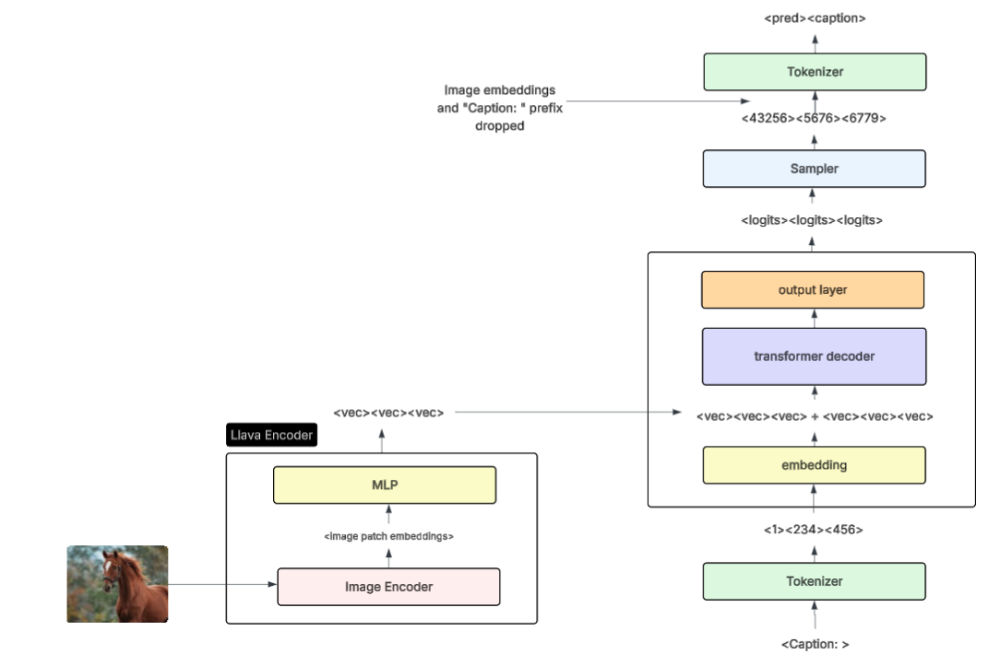

# Image Captioning with Language Models

This project contains a Vision Language Model inspired by techniques introduced in the Llava (Large Language and Vision Assistant) [paper](https://arxiv.org/pdf/2304.08485). This approach adds multimodality to a language model by training a small multilayer perceptron (MLP) to project image patch embeddings to the text embedding space. Then, the image embeddings are prepended to the text embeddings before feeding to the decoder module. The following diagram depicts the VLM architecture. 



See the full [paper](https://docs.google.com/document/d/14BePoIP4aekijnXcAckVHpLJZSdsy1SYWX0iz9QJk48/edit?usp=sharing) for more details about motivations, experiment results, and future research. 

## Environment Setup

To setup the environment locally, run `pip install environment.txt`.

### Anaconda

If using Anaconda:

```
conda env create -f environment.yaml
conda activate image_captioning
```

### Google Collab

If you do not have access to a GPU, the best way to run this project is in Google Collab. You can download the [Google Drive for Desktop](https://support.google.com/drive/answer/10838124?hl=en) application and sync this folder to Google drive. Then, import an experiment notebook and modify the cell at the top of the notebook to include the path to your mounted directory. The notebooks install the dependencies not included in collab. 

## Quick Start

The model weights for all experiments are saved in HuggingFace. You can run a single model or download all model weights with the following commands. The models are saved efficiently, and it should not take more than a few minutes to download all weights.

- `make model_1`: pull, build, and run the model for experiment 1 (requires ~7GB GPU RAM to run)
- `make model_2`: pull, build, and run the model for experiment 2 (requires ~27.5GB GPU RAM to run)
- `make model_3`: pull, build, and run the model for experiment 3 (requires ~7GB GPU RAM to run)
- `make model_4`: pull, build, and run the model for experiment 4 (requires ~27.5GB GPU RAM to run)
- `make model_5`: pull, build, and run the model for experiment 5 (requires ~27.5GB GPU RAM to run)
- `make model_6`: pull, build, and run the model for experiment 6 (requires ~27.5GB GPU RAM to run)
- `make all_weights`: pull all model weights and save to `./model_weights` folder

After running `make model_{n}`, you can make the following request to get a caption from the model:

```
curl -X POST http://localhost:5000/caption \                    
     -H "Content-Type: application/json" \
     -d '{"image_path": "./experiments/evaluation_images/image_1.jpg"}'
```

The `qualitative_comparison.ipynb` and `sampling_exploration.ipynb` notebooks require running `make all_weights` first.

## Overview

- `/encoders/image_encoder_with_projections.py`: file containing the llava mlp implementation with pretrained encoders (currently supports `clip` and `vit` encoders)
- `/encoders/image_encoder.py`: file containing the bare pretrained image encoders to output patch embeddings (currently supports `clip` and `vit` encoders)
- `/decoders/*`: directory containing wrappers for the decoders tested (currently supports `gpt2` and `vicuna`)
- `/evaluations/*`: directory containing plots and captions for previous evaluations with timestamps
- `/experiments/*`: directory containing the notebooks for each experiment, a sampling exploration notebook, and a qualitative results comparison of all models. 
- `/scripts/*`: scripts to push and pull model weights from a HuggingFace repository.
- `download_data.py`: script to download and partition the flickr30k dataset
- `data_processing.py`: script containing batch loading and data visualization helper functions
- `evaluation.py`: script containing evaluation helper functions
- `train.py`: the VLM training loop and plotting functions
- `vision_language_model.py`: the main class for the `VisionLanguageModel`
- `main.py`: a script to load a model from a weights file and run an endpoint that takes a single image and returns a single caption

## Development

You can begin development by creating a copy of one of the notebooks and naming it `experiment_n.ipynb`. Then, tune the training parameters or model type and run a new experiment. Don't forget to change the `experiment_name` variable at the top of the notebook to be used for file names. 
